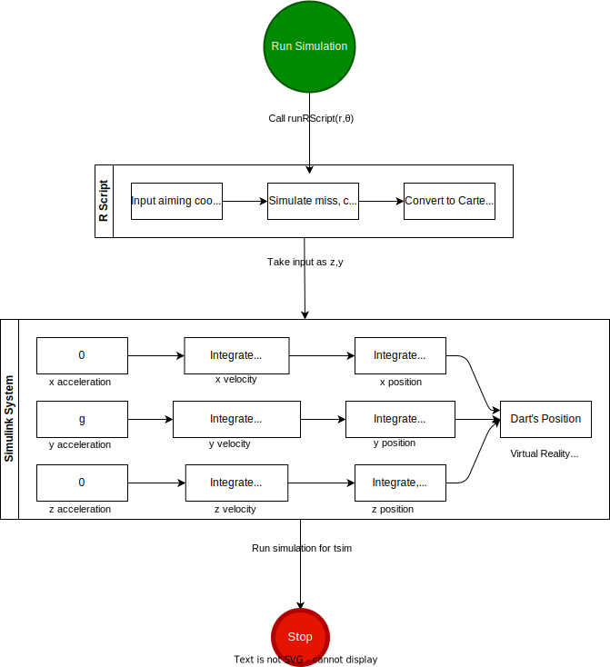

<h1 align="center"> Darts </h1>
<h3 align="center"> Animation of a Dart's Trajectory using MATLAB, Simulink, and R </h3> 
<h3 align="center"> Author: Oscar Jaroker  Date Created: 10 March 2024</h3>  

<h2> Introduction </h2>

The goal of this project is to calculate and animate the trajectory of a dart thrown at a dartboard that will miss randomly from a selected aiming location. The project uses a $\texttt{MATLAB}$ Simulink environment to control the dynamics of the system, a world created with $\texttt{X3D}$ for the animation, and runs an $\texttt{R}$ script non-interactively to simulate the random miss of the dart. This project is an extension of a Dartbot program written in $\texttt{R}$ for a Computational Statistics course. The $\texttt{R}$ code was not converted to $\texttt{MATLAB}$ because of certain statistical functions and abilities of $\texttt{R}$ that would become much more complex in $\texttt{MATLAB}$. The $\texttt{getDifficulty()}$ and $\texttt{simulateThrow()}$ functions in $\texttt{dartsRProg.R}$ were written by Professor Cipolli at Colgate University.

<h2> Flow </h2>

<h2> MATLAB Communication with R </h2>

The $\texttt{runRScript()}$ function in $\texttt{MATLAB}$ takes two arguments, $r$ and θ values. These are sent to the $\texttt{R}$ file using the $\texttt{system()}$ function, which executes operating system commands directly. The command to run $\texttt{R}$ scripts non-interactively is:\
    `R CMD BATCH [options] infile [outfile]`\
Where one of the options is `'--args arg1 arg2'`. In this case, arg1 and arg2 are $r$ and θ, respectively.\
**Note**: R must be installed on your computer to execute this command (Download [here](https://cran.r-project.org/mirrors.html)).\
Because the output file generated by $\texttt{R}$ is a little difficult to read as input, the $\texttt{runRScript()}$ function writes the output coordinates to $\texttt{out.csv}$, which $\texttt{MATLAB}$ subsequently reads and parses, ultimately returning the same output as the $\texttt{R}$ script.

<h2> 3D World Specifications </h2>

Originally, the world was written $\texttt{VRML}$ (Virtual Reality Modeling Language), but was later converted to $\texttt{X3D}$, the successor of $\texttt{VRML}$ with extended capabilities. For example, one could add a Touch Sensor to the dartboard with $\texttt{X3D}$ that could not be done with a $\texttt{VRML}$ world. \
The dartboard itself is a $\texttt{Billboard}$ node which displays the image $\texttt{dartboardPNG.png}$. \
The $\texttt{MATLAB}$ 3D World Editor is useful for creating worlds and was used to set the simulation's viewpoint as well as create the dart. To save the time of creating a new point set for a dart, the dart in the game is actually an $\texttt{X3D}$ model of an AIM-9 Sidewinder missile supplied by $\texttt{MATLAB}$'s component library, with a supplied $\texttt{fire.png}$ texture.\
The $\texttt{`Dart'}$ node is given an initial $\texttt{translation}$ value, or position, which is exactly $50$ units away from the dartboard in the $\texttt{x}$ direction. Helpful to the developer, nodes in the $\texttt{MATLAB}$ 3D environment have two values of $\texttt{translation}$, an initial value and a value relative to the initial. The relative $\texttt{translation}$ is what is updated during the simulation, starting at $(0,0,0)$ and ending at $(50,y_f,z_f)$.\
**Note**: In the X3D world, the $y$ direction is up/down.

<h2> Mechanics of the Simulation </h2>

The trajectory of the dart is governed parametrically, where the parameter $t$ goes from $0$ to $t_{sim}$, which is $15$ units of time in the Simulink model. If one wanted to make the dart fly faster, lowering $t_{sim}$ and adjusting a few other values would do the trick. The value of $t$ increases in steps of $0.1$, as set by $\texttt{MATLAB}$'s differential equation solver, $\texttt{ode45}$. The Simulink model starts with constant values of acceleration for each coordinate, which are as follows:\
$\frac{d^2x}{dt^2} = 0$, $\frac{d^2y}{dt^2} = 0.5$ down, $\frac{d^2z}{dt^2} = 0$\
The value of $0.5$ for acceleration in the $y$ direction is an estimation of the value of gravity in the $\texttt{X3D}$ world.\
Next, Simulink's integrator blocks are used to work with velocities. Initial conditions must be specified here. Because the dart must travel exactly $50$ units in the x direction in $15$ units of time no matter the throw, the $x$ velocity is constant at $\frac{50}{15}$, or $\frac{10}{3}$.\
In calculating $y$ and $z$ initial velocities is where the relative translation is very helpful. Because the $y$ and $z$ values returned from the $\texttt{runRScript()}$ function are the final $y_f$ and $z_f$ values of the dart relative to its starting position (modified by a factor of $0.1$ to convert $mm$ to $cm$), the initial $y$ and $z$ velocities are $\frac{y_f}{t_{sim}}$ and $\frac{z_f}{t_{sim}}$, respectively.\
In order to mimic gravity and create a parabolic trajectory with the estimiated gravity value, $0.375$ is added to the initial $y$ velocity. The following calculations occur in the Simulink model:\
$\frac{dx}{dt} = \int \frac{d^2x}{dt^2}\;dt = \int 0\;dt = 0 + \frac{10}{3} = \frac{10}{3}$\
$\frac{dy}{dt} = \int \frac{d^2y}{dt^2}\;dt = \int 0.5\;dt = 0.5t+0.375+\frac{y_f}{t_{sim}}$\
$\frac{dz}{dt} = \int \frac{d^2z}{dt^2}\;dt = \int 0\;dt = 0+\frac{z_f}{t_{sim}} = \frac{z_f}{t_{sim}}$\
The final step is to calculate position. Note the initial position of the dart is $(0,0,0)$, so no constants of integration will be added.\
$x(t) = \int \frac{dx}{dt}\;dt = \frac{10}{3}t$\
$y(t) = \int \frac{dy}{dt}\;dt = \frac{1}{4}t^2+(0.375+\frac{y_f}{t_{sim}})t$\
$z(t) = \int \frac{dz}{dt}\;dt = \frac{z_f}{t_{sim}}t$\
Finally, $x$, $y$, and $z$, all parameterized with time, are sent to the VR Sink block, which updates the $\texttt{translation}$ of the dart every time the simulation 'takes' a step. Below is what the actual Simulink model looks like in the editor:\

<h2> Folder Structure </h2>

<pre>
Darts/
├── MATLAB/
│   ├── DartsModel.slx
│   ├── dartsRProg.R
│   └── runRScript.m
└── 3D Environment/
    ├── dartWorldX3D.x3d
    ├── dartboardPNG.png
    └── Fire.png
</pre>